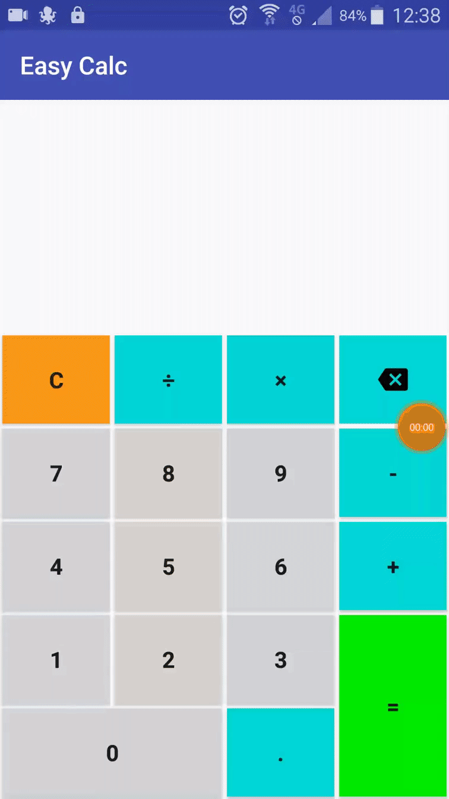

# Easy Calc
*A (not so) simple calculator for Android*

## How to run
1) Clone the repository
2) Import the project to Android Studio or IntellijIDEA
3) Update dependencies and/or gradle version if necessary
4) Build the APK
5) Profit! (Install it in your device) :D

## Contributing
Pull requests are welcome!

## License
Read about license rights and limitations [here](LICENSE).
